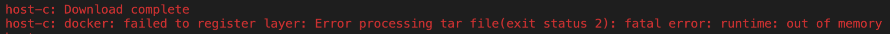

# DNCS-LAB ASSIGNMENT FOR A.Y. 2019/20

On this project works, as collaborators, **Federico Rodigari** and **Francesco Zoccatelli** for the course of *"Design of Networks and Communication Systems"* hosted in UniTN.

## Table of contents:

- [DNCS-LAB ASSIGNMENT FOR A.Y. 2019/20](#dncs-lab-assignment-for-ay-201920)
  - [Table of contents:](#table-of-contents)
- [Requirements](#requirements)
  - [Design Requirements](#design-requirements)
  - [Network map](#network-map)
- [Our approach to the project](#our-approach-to-the-project)
  - [IP Adresses](#ip-adresses)
  - [VLAN](#vlan)
  - [Updated Network map](#updated-network-map)
- [Code](#code)
  - [Vagrantfile](#vagrantfile)
  - [ROUTERS](#routers)
  - [SWITCH](#switch)
  - [HOSTS](#hosts)
- [Tests](#tests)
  - [Routing table](#routing-table)
  - [Reachability](#reachability)
  - [WebServer](#webserver)
- [Authors and acknowledgment](#authors-and-acknowledgment)

# Requirements
 - Python 3
 - 10GB disk storage
 - 2GB free RAM
 - Virtualbox
 - Vagrant (https://www.vagrantup.com)
 - Internet

## Design Requirements
- Hosts 1-a and 1-b are in two subnets (*Hosts-A* and *Hosts-B*) that must be able to scale up to respectively 380 and 50 usable addresses
- Host 2-c is in a subnet (*Hub*) that needs to accommodate up to 406 usable addresses
- Host 2-c must run a docker image (dustnic82/nginx-test) which implements a web-server that must be reachable from Host-1-a and Host-1-b
- No dynamic routing can be used
- Routes must be as generic as possible
- The lab setup must be portable and executed just by launching the `vagrant up` command

## Network map

```
        +-----------------------------------------------------+
        |                                                     |
        |                                                     |eth0
        +--+--+                +------------+             +------------+
        |     |                |            |             |            |
        |     |            eth0|            |eth2     eth2|            |
        |     +----------------+  router-1  +-------------+  router-2  |
        |     |                |            |             |            |
        |     |                |            |             |            |
        |  M  |                +------------+             +------------+
        |  A  |                      |eth1                       |eth1
        |  N  |                      |                           |
        |  A  |                      |                           |
        |  G  |                      |                     +-----+----+
        |  E  |                      |eth1                 |          |
        |  M  |            +-------------------+           |          |
        |  E  |        eth0|                   |           |  host-c  |
        |  N  +------------+      SWITCH       |           |          |
        |  T  |            |                   |           |          |
        |     |            +-------------------+           +----------+
        |  V  |               |eth2         |eth3                |eth0
        |  A  |               |             |                    |
        |  G  |               |             |                    |
        |  R  |               |eth1         |eth1                |
        |  A  |        +----------+     +----------+             |
        |  N  |        |          |     |          |             |
        |  T  |    eth0|          |     |          |             |
        |     +--------+  host-a  |     |  host-b  |             |
        |     |        |          |     |          |             |
        |     |        |          |     |          |             |
        ++-+--+        +----------+     +----------+             |
        | |                              |eth0                   |
        | |                              |                       |
        | +------------------------------+                       |
        |                                                        |
        |                                                        |
        +--------------------------------------------------------+

```


# Our approach to the project
We decide to divide our network in 4 sub-networks, with 2 of these that are VLAN based (to "split" the switch into two virtual switches). 

The 4 networks are:
- *"A"*: this subnet contains **"host-a"**, other **378 hosts** and the **router-1 port (enp0s8.9)**
- *"B"*: this subnet contains **"host-b"**, other **48 hosts** and the **router-2 port (enp0s8.10)**
- *"C"*: this subnet contains **"host-c"**, other **404 hosts** and the **router-2 port (enp0s8)**
- *"D"*: this subnet contains the 2 ports left on both routers (enp0s9 on both)

## IP Adresses
We used IPs starting from 192.168.2.0 as it was simpler for our design.

To assign IP adresses to the VMs we had to follow the requirements, that say:
- *"A"* contains "host-a" and must be able to scale up to 380 usable addresses
- *"B"* contains "host-b" and must be able to scale up to 50 usable addresses
- *"C"* contains "host-c" must be able to scale up to 406 usable addresses

| Subnet |   Address    | Netmask | Hosts needed | Hosts available |
| :----- | :----------: | :-----: | :----------: | :-------------: |
| *A*    | 192.168.2.0  |   /23   |     380      |       510       |
| *B*    | 192.168.4.0  |   /24   |      50      |       254       |
| *C*    | 192.168.6.0  |   /23   |     406      |       510       |
| *D*    | 192.168.10.0 |   /30   |      2       |        2        |

In order to calculate how many hosts will be allowed on each subnet we used this formula:
```
Number of available IPs for network = ((2^h)-2)
```
The h represents the number of zeros in the subnet mask, if the subnet mask were converted to binary. The first and last addresses are reserved: the first to identify the network and the last to be used as the broadcast address. This is the reason why there is "-2" in the previous formula.

## VLAN

  | Subnet | Interface | Vlan tag |          IP |
  | -----: | :-------: | :------: | ----------: |
  |    *A* | enp0s8.9  |    9     | 192.168.2.1 |
  |    *B* | enp0s8.10 |    10    | 192.168.4.1 |

We decided to use vlans for the networks "*A*" and "*B*", so we can split the switch in two virtual switches. 

- SWITCH: split in two VLAN: "VLAN 9" and "VLAN 10"
- ROUTER-1: create a link between router-1 and VLANs in trunk mode

## Updated Network map 

```


        +----------------------------------------------------------+
        |                         192.168.10.1/30   192.168.10.2/30|
        |                                                          |enp0s3
        +--+--+                +------------+  ^          ^   +------------+
        |     |                |            |  |          |   |            |
        |     |          enp0s3|            |  \  enp0s9  /   |            |
        |     +----------------+  router-1  +-----------------+  router-2  |
        |     |                |            |                 |            |
        |     |                |            |                 |            |
        |  M  |                +------------+                 +------------+
        |  A  |      192.168.2.1/23  |  enp0s8.9             enp0s8 | 192.168.6.1/23
        |  N  |      192.168.4.1/24  |  enp0s8.10                   |
        |  A  |                      |                       enp0s8 | 192.168.6.2/23
        |  G  |                      |                        +-----+----+
        |  E  |                      |  enp0s8                |          |
        |  M  |            +----------------------+           |          |
        |  E  |      enp0s3|                      |           |  host-c  |
        |  N  +------------+        SWITCH        |           |          |
        |  T  |            |  9               10  |           |          |
        |     |            +----------------------+           +----------+
        |  V  |        enp0s9 |                | enp0s10            |enp0s3
        |  A  |               |                |                    |
        |  G  | 192.168.2.2/23|                |192.168.4.2/24      |
        |  R  |         enp0s8|                |enp0s8              |
        |  A  |        +----------+     +----------+                |
        |  N  |        |          |     |          |                |
        |  T  |  enp0s3|          |     |          |                |
        |     +--------+  host-a  |     |  host-b  |                |
        |     |        |          |     |          |                |
        |     |        |          |     |          |                |
        +-+---+        +----------+     +----------+                |
        | |                              |enp0s3                    |
        | |                              |                          |
        | +------------------------------+                          |
        |                                                           |
        |                                                           |
        +-----------------------------------------------------------+


```

# Code
In this section, we will describe the code that allowed us to build our project as well as the changes we made on the code that we pulled form the following GitHub repository [dustnic/dncs-lab](https://github.com/dustnic/dncs-lab)

## Vagrantfile 

- Firstly, we changed the path of the *.sh* file for every VM, linking the correct configuration file for every machine
  
```
24  router1.vm.provision "shell", path: "router-1.sh"
```

- Secondly we had to make some more changes due to the following error:


 
 to solve this issue we had to increase the amount of memory allocated for *host-c* in order to make the docker work
```
74  vb.memory = 512
```

## Routers
```
#CONFIGURATIONS

export DEBIAN_FRONTEND=noninteractive
sudo su
apt-get update
apt-get install -y tcpdump --assume-yes
sysctl net.ipv4.ip_forward=1

# 1 ip add and ip link operations 
# 2 (only for router 1) vlan subinterface creation

ip route del default #Delete the default gateway

# 3 Static routes creation
```
- **router-1**
  1. Set interface of the subnet *D* 192.168.10.1/30
  2. Create subinterface for Vlan 9 and Vlan 10
  3. Subnet C reachable from 192.168.10.2 *(Router-2)*
- **router-2**
  1. Set interface of the subnet *D* 192.168.10.2/30 and of the subnet *C* 192.168.6.1
  2. Subnet A and B reachable from 192.168.10.1 *(Router-1)*
  
## Switch
```
#CONFIGURATIONS

export DEBIAN_FRONTEND=noninteractive
sudo su
apt-get update
apt-get install -y tcpdump
apt-get install -y openvswitch-common openvswitch-switch apt-transport-https ca-certificates curl software-properties-common

# 1 Create a new bridge "switch"
ovs-vsctl add-br switch

#2 Create a trunk port and set interface up
ovs-vsctl add-port switch enp0s8
ip link set enp0s8 up

#3 Add port on the switch with tag 9 and 10
ovs-vsctl add-port switch enp0s9 tag=9
ip link set enp0s9 up
ovs-vsctl add-port switch enp0s10 tag=10
ip link set enp0s10 up
```

## Hosts
```
#COMMON
export DEBIAN_FRONTEND=noninteractive
sudo su
apt-get update
apt-get install -y tcpdump --assume-yes

#1 (only for host c) docker settings

#2 ip add and ip link operations 

ip route del default #Delete the default gateway

# 3 Set default gateways
```
- **host-a**
  2. Set interface of the subnet *A* to 192.168.2.1/23
  3. Set default gateway to 192.168.2.1
- **host-b**
  2. Set interface of the subnet *B* 192.168.4.1/24
  3. Set default gateway to 192.168.4.1
- **host-c**
  1. Docker and curl installation 
    - docker run image "dustnic82/ngix-test"
  2. Set interface of the subnet *C* to 192.168.6.1/24
  3. Subnet *A* and *B* reachable via 192.168.6.1 (Router-2)


# Tests
In this section we will describe some commands that we used to check if our project was correct. In particular we checked the route, the reachability of the hosts and the correct functioning of the WebServer.

## Routing table
We were able to display the routing tables of the components of the network via the command ```route -nve```.
This can help to show route information about directly connected and remote networks.

**HOST A**
| Destination |   Gateway   |     Genmask     |  Iface |
| :---------- | :---------: | :-------------: | -----: |
| 0.0.0.0     | 192.168.2.1 |     0.0.0.0     | enp0s8 |
| 10.0.2.0    |   0.0.0.0   |  255.255.255.0  | enp0s3 |
| 10.0.2.2    |   0.0.0.0   | 255.255.255.255 | enp0s3 |
| 192.168.2.0 |   0.0.0.0   |  255.255.254.0  | enp0s8 |

**HOST B**
| Destination |   Gateway   |     Genmask     |  Iface |
| :---------- | :---------: | :-------------: | -----: |
| 0.0.0.0     | 192.168.4.1 |     0.0.0.0     | enp0s8 |
| 10.0.2.0    |   0.0.0.0   |  255.255.255.0  | enp0s3 |
| 10.0.2.2    |   0.0.0.0   | 255.255.255.255 | enp0s3 |
| 192.168.4.0 |   0.0.0.0   |  255.255.255.0  | enp0s8 |

**HOST C**
| Destination |   Gateway   |     Genmask     |   Iface |
| :---------- | :---------: | :-------------: | ------: |
| 0.0.0.0     |  10.0.2.2   |     0.0.0.0     |  enp0s3 |
| 10.0.2.0    |   0.0.0.0   |  255.255.255.0  |  enp0s3 |
| 10.0.2.2    |   0.0.0.0   | 255.255.255.255 |  enp0s3 |
| 172.17.0.0  |   0.0.0.0   |   255.255.0.0   | docker0 |
| 192.168.2.0 | 192.168.6.1 |  255.255.254.0  |  enp0s8 |
| 192.168.4.0 | 192.168.6.1 |  255.255.255.0  |  enp0s8 |
| 192.168.6.0 |   0.0.0.0   |  255.255.254.0  |  enp0s8 |

**ROUTER 1**
| Destination  |   Gateway    |     Genmask     |     Iface |
| :----------- | :----------: | :-------------: | --------: |
| 10.0.2.0     |   0.0.0.0    |  255.255.255.0  |    enp0s3 |
| 10.0.2.2     |   0.0.0.0    | 255.255.255.255 |    enp0s3 |
| 192.168.2.0  |   0.0.0.0    |  255.255.254.0  |  enp0s8.9 |
| 192.168.4.0  |   0.0.0.0    |  255.255.255.0  | enp0s8.10 |
| 192.168.6.0  | 192.168.10.2 |  255.255.254.0  |    enp0s9 |
| 192.168.10.0 |   0.0.0.0    | 255.255.255.252 |    enp0s9 |

**ROUTER 2**
| Destination  |   Gateway    |     Genmask     |  Iface |
| :----------- | :----------: | :-------------: | -----: |
| 10.0.2.0     |   0.0.0.0    |  255.255.255.0  | enp0s3 |
| 10.0.2.2     |   0.0.0.0    | 255.255.255.255 | enp0s3 |
| 192.168.2.0  | 192.168.10.1 |  255.255.254.0  | enp0s9 |
| 192.168.4.0  | 192.168.10.1 |  255.255.255.0  | enp0s9 |
| 192.168.4.0  |   0.0.0.0    |  255.255.252.0  | enp0s8 |
| 192.168.10.0 |   0.0.0.0    | 255.255.255.252 | enp0s9 |

## Reachability 
To see if the host were reachable we used "ping [ip adress]".
Ping is a network tool to test whether a particular host is reachable across an IP network.
Through this command we checked that the hosts a, b and c were reachable. 
For example we tried to ping *host-c* from *host-a* due to the commands ```vargrant ssh host-a``` and ```ping 192.168.6.2```.
These are the results: 

| bytes |    from     | icmp_seq |  ttl  | time    |
| ----: | :---------: | :------: | :---: | :------ |
|    64 | 192.168.6.2 |    1     |  62   | 1.63 ms |
|    64 | 192.168.6.2 |    2     |  62   | 1.57 ms |
|    64 | 192.168.6.2 |    3     |  62   | 1.78 ms |
|    64 | 192.168.6.2 |    4     |  62   | 1.52 ms |
|    64 | 192.168.6.2 |    5     |  62   | 1.65 ms |

```
5 packets transmitted, 5 received, 0% packet loss, time 4004ms
rtt min/avg/max/mdev = 1.527/1.635/1.786/0.097 ms
```

## WebServer 
In order to check if the docker were succesfully installed we used the command ```curl``` that is a command line tool to transfer data to or from a server.
In our case we used ```curl 192.168.6.2``` from *host-a* in order to get response from the docker that is "hosted" on *host-c*

```
<!DOCTYPE html>
<html>
<head>
<title>Welcome to nginx!</title>
<style>
    body {
        width: 35em;
        margin: 0 auto;
        font-family: Tahoma, Verdana, Arial, sans-serif;
    }
</style>
</head>
<body>
<h1>Welcome to nginx!</h1>
<p>If you see this page, the nginx web server is successfully installed and
working. Further configuration is required.</p>

<p>For online documentation and support please refer to
<a href="http://nginx.org/">nginx.org</a>.<br/>
Commercial support is available at
<a href="http://nginx.com/">nginx.com</a>.</p>

<p><em>Thank you for using nginx.</em></p>
</body>
</html>
```

# Notes and References
- https://rogerdudler.github.io/git-guide/
- http://therandomsecurityguy.com/openvswitch-cheat-sheet/
- https://www.cyberciti.biz/faq/howto-linux-configuring-default-route-with-ipcommand/
- https://www.vagrantup.com/intro/getting-started/
- https://linux.die.net/man/8/ip

# Authors and acknowledgment

This project for the course of **Design of Networks and Communication System** was developed from *Federico Rodigari* and *Francesco Zoccatelli*. We started forking the repository from [dustnic/dncs-lab]. This project is powered by dustnic.
